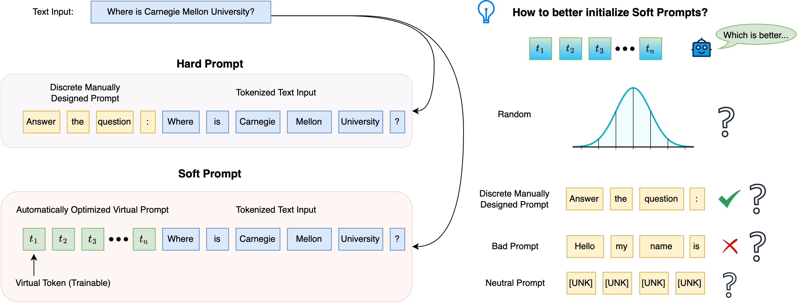
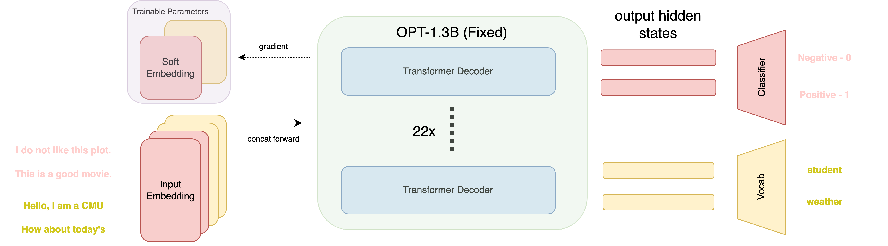

# IDL Project: Optimizing Large Language Models on Downstream Tasks with Better Soft Prompts

   





## Get Started

```bash
git clone https://github.com/preminstrel/IDL-Project.git
cd IDL-Project

# install packages
pip install -r requirements.txt
```

File tree is shown below:

```bash
.
├── README.md
├── archive
├── config
├── data
│   └── dataset.py
├── engine.py
├── main.py
├── models
│   └── build.py
├── requirements.txt
└── utils
    ├── info.py
    └── parser.py
```

As shown,

- the config files are at `config` folde, including model arch, hyperparams, etc.
- all models are built in `models/build.py`
- `engine.py` is for `train, eval, test`
- you can find `data/dataset.py`
- the `utils` folder is full of some small tools for beautiful logging, model saving/resuming, etc.
- `archive` folder is used to store log file, figure, and model weights, here I only upload some training figures
- `main.py` is the main interface for training, validation, and testing

## Experiment

You can run the scripts using `python main.py --config {config.yaml}`:

